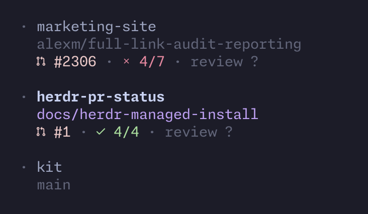

# herdr-pr-status

An early-stage public PR-status plugin for Herdr 0.9.0+, written in TypeScript and run directly with Bun. Requires Git and authenticated `gh`. Includes manual refresh and configurable polling. No GitHub writes, cache, or sidebar-layout changes.



*Actual Herdr sidebar showing workspace branches, passing and failing PR checks, and review status.
[Optional color configuration used in this screenshot](docs/sidebar.md).*

## Requirements and installation

Tested toolchain: Herdr **0.9.x** (locally verified CLI: 0.9.1), Bun **1.4.2**,
GitHub CLI (`gh`) **2.101.0**, and Git **2.54.0**. macOS and Linux are supported;
CI checks both. Use a **Nerd Font v3.4-compatible** terminal font for the default icons.
Authenticate `gh` for the repositories you want to read before using the plugin.

Install the GitHub source into Herdr's managed plugin directory:

```sh
herdr plugin install alx-xo/herdr-pr-status
```

Then, from a terminal inside your existing Herdr session:

```sh
herdr plugin action invoke alx-xo.pr-status.start
```

Installation registers the plugin; explicit start publishes workspace tokens and
begins polling in that session. Herdr runs the TypeScript source directly with
Bun, not an npm package or compiled artifact. There are no runtime package
dependencies, so users do not need `bun install` or a build step.

See the official [Herdr 0.9.1 plugin documentation](https://github.com/herdrdev/herdr/blob/master/docs/versions/0.9.1/website/src/content/docs/plugins.mdx)
for installation, build and startup behavior.

Use Herdr actions for diagnostics and control without entering the managed
checkout. `info` is local; `preview` reads GitHub without metadata writes:

```sh
herdr plugin action invoke alx-xo.pr-status.info
herdr plugin action invoke alx-xo.pr-status.preview
herdr plugin action invoke alx-xo.pr-status.refresh
herdr plugin action invoke alx-xo.pr-status.start
herdr plugin action invoke alx-xo.pr-status.status
herdr plugin action invoke alx-xo.pr-status.stop
herdr plugin log list --plugin alx-xo.pr-status --limit 3
```

Action acceptance only means the process started. Check the completed log and sidebar. Preview/refresh print one result per workspace and exit nonzero if any workspace failed; successful workspaces still update. Unsupported or ambiguous checkout discovery is explicitly skipped. Lookup failure preserves old metadata, so existing badges may be stale until the next successful refresh.

**Before switching from another PR plugin:** disable its registration and stop its specific detached poller, if any. Shared token names can otherwise compete. Herdr tokens are per-workspace, last-update-wins patches, not per-source overlays. This plugin sets or clears only the four familiar PR tokens; unrelated tokens are left alone. Other plugins and sidebar layout are not changed automatically.

## Updating or migrating an installation

Registration and the managed checkout are global to the current user, but workers
are session-local. Before replacing source, run these commands inside **each
running Herdr session** using the plugin:

```sh
herdr plugin action invoke alx-xo.pr-status.stop
herdr plugin action invoke alx-xo.pr-status.status
herdr plugin log list --plugin alx-xo.pr-status --limit 3
```

Wait for the stop action's completed log, then check the completed status log for
`running: false`. Action acceptance alone is not shutdown confirmation; repeat
status and log checks if necessary. Only after all session workers have stopped:

- **Managed update:** rerun `herdr plugin install alx-xo/herdr-pr-status`.
  Herdr replaces the managed checkout; there is no separate update command.
- **Local-link migration:** run `herdr plugin unlink alx-xo.pr-status`, then
  `herdr plugin install alx-xo/herdr-pr-status`. Installing over a local link is
  refused. Unlink leaves the local checkout files alone.

Existing plugin config and state remain in place. Do not overwrite your active
sidebar layout. After installation, explicitly invoke `alx-xo.pr-status.start` in
each running session that should poll. Do not kill or restart the Herdr server.

## Polling

PR status refreshes automatically: every **30 seconds** for the active workspace
and **60 seconds** for background workspaces by default. Configure these with
`activePollSeconds` and `pollSeconds` (15–3600 seconds).

Use the Herdr plugin actions to `start`, `stop`, or manually `refresh`.
Use `status` or `preview` for diagnostics; results appear in the action log.

## Formatting

Edit `config.json` under the directory printed by:

```sh
herdr plugin config-dir alx-xo.pr-status
```

Actions use `HERDR_PLUGIN_CONFIG_DIR`; manual CLI runs ask Herdr for it. No file means defaults. The file is reread every invocation and local observation. Partial settings are merged with defaults; invalid types, unknown keys and multiline labels fail before any publishing.

Example (all settings optional):

```json
{
  "pollSeconds": 60,
  "activePollSeconds": 30,
  "hideZeroThreads": true,
  "visible": {
    "pr": true,
    "pr_checks": true,
    "pr_review": true,
    "pr_threads": true
  },
  "labels": {
    "open": "",
    "draft": "WIP",
    "merged": "",
    "closed": "",
    "approved": "approved",
    "changes_requested": "changes",
    "required": "review",
    "threads": "threads",
    "unknown": "?"
  },
  "icons": {
    "draft": "D"
  }
}
```

Defaults use lifecycle icons with the PR number (e.g. ` #6401`), icon + short review text, and hide known zero threads. That example overrides draft formatting to `D #6401 WIP`. Review labels are text only; review icons are configured separately under `icons` (`approved`, `changes_requested`, `required`). Set an icon to `""` to suppress it. It changes token text, not Herdr's indentation, row placement, separators, or styles. Custom labels may no longer match your existing color rules. Emoji appearance depends on the renderer and has not been diagnosed here.

| Token | Meaning |
| --- | --- |
| `$pr` | Number and lifecycle icon: open / draft / merged / closed |
| `$pr_checks` | Passed/total checks; failure takes precedence over pending; `no checks` for known zero |
| `$pr_review` | Review decision, independent of checks and lifecycle |
| `$pr_threads` | Unresolved review-thread count, across pages; known zero hidden by default |

Check totals include GitHub status contexts and check runs; neutral/skipped runs count as passing. Unknown data displays `?`, not zero. Lifecycle never becomes “failed” because CI failed. Confirmed absent PRs and hidden fields clear the corresponding shared token keys. Unrelated token keys are untouched; another running reporter could overwrite the shared keys again.

## Icons

Nerd Font icons are built in. A Nerd Font v3.4-compatible terminal font is required; there is no icon-style selector, detection, or fallback set. Individual `icons` overrides remain available, along with text labels and visibility settings.

The built-in Octicons are: PR open `U+F407`, draft `U+F4DD`, merged `U+F419`, closed `U+F4DC`; checks passing `U+F42E`, failed `U+F467`, pending `U+F43A`; review approved `U+F49E`, changes requested `U+F440`, required `U+F4AF`.

Unknown checks/review and thread counts remain plain text. Glyph identifiers verified against [Nerd Fonts v3.4.0](https://github.com/ryanoasis/nerd-fonts/blob/v3.4.0/glyphnames.json).

Herdr sidebar rows and color rules live in Herdr's config. See the [optional sidebar color configuration](docs/sidebar.md) for copyable rows and Catppuccin Mocha colors matching the default tokens. Merge it into your existing sidebar configuration; do not replace your full config. Custom icon or label overrides may require corresponding color-rule changes. The plugin does not modify Herdr config automatically. Settings are reread on manual refresh and local observation.

Failed refreshes show `⚠` (alongside the last known badges only for the same branch and repository). `status` and `preview` report the reason, next action, and refresh freshness; a successful lookup clears the warning.

## Development

For local development, clone into a permanent directory: Herdr links this
checkout, so do not move or delete it while linked.

```sh
git clone https://github.com/alx-xo/herdr-pr-status.git
cd herdr-pr-status
bun install --frozen-lockfile
herdr plugin link .
```

Linking does not run build hooks. In an existing Herdr session, explicitly invoke
`alx-xo.pr-status.start` as above. Development checks:

```sh
bun run typecheck
bun test
bun run build
bun dist/main.js info
```

Modules separate bounded subprocess execution, read-only GitHub lookup, pure formatting, Herdr discovery/publishing, and orchestration. Tests use injected command runners rather than live GitHub/Herdr writes. The optional build produces Bun-targeted JavaScript; Herdr itself invokes `bun src/main.ts` directly.

## License

[MIT](LICENSE), copyright 2026 alx-xo.
