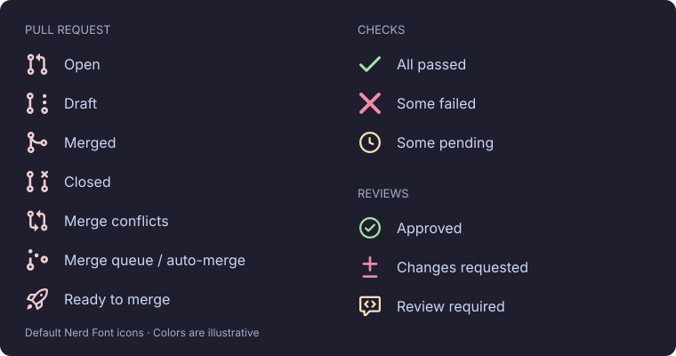

# herdr-pr-status

GitHub pull request status, right in your Herdr sidebar.

See PR state, CI checks, review decisions, and unresolved review threads alongside
your workspace branches. Status updates automatically in the background—no
routine commands or configuration changes needed.


*PR status, checks, and reviews alongside your workspace branches.*

## Features

- **PR state:** See whether a pull request is open, draft, merged, or closed, with
  indicators for conflicts, merge queue or auto-merge, and merge readiness.
- **CI checks:** See passed/total checks and whether any are failing or pending.
- **Reviews:** Know whether a PR is approved, needs changes, or is awaiting review.
- **Unresolved threads:** See outstanding review conversations; zero-thread counts
  stay hidden by default.
- **Automatic updates:** Refreshes every **30 seconds** for the active workspace
  and every **60 seconds** for background workspaces.

Read-only access to GitHub. The plugin never modifies your pull requests.

### Status icons



*Default icon shapes; colors depend on your [sidebar settings](docs/sidebar.md).*

## Quick start

Requires **Herdr 0.9.0+**, **Bun**, **Git**, and the **GitHub CLI (`gh`)** on macOS
or Linux. Authenticate `gh` for the repositories you want to read before starting.

Install the plugin:

```sh
herdr plugin install alx-xo/herdr-pr-status
```

Then, from a terminal inside your existing Herdr session, start it:

```sh
herdr plugin action invoke alx-xo.pr-status.start
```

Once started, the plugin keeps your PR status up to date in the background.
No plugin configuration file is required.

The plugin supplies PR sidebar tokens without changing your Herdr layout. If your
layout doesn't already display them, see the [sidebar setup](docs/sidebar.md).

Default icons need a **Nerd Font v3.4-compatible** terminal font. For plain Unicode
symbols, set `"iconSet": "unicode"` in the optional
[plugin configuration](docs/configuration.md).

## Optional customization

Defaults work out of the box. You can optionally change icons, labels, visible
fields, and refresh intervals in the [configuration reference](docs/configuration.md).
For the colors used in the screenshot, see [sidebar colors](docs/sidebar.md).

## Good to know

- Workspaces without a matching PR show no PR badges.
- If a refresh fails, previous status may remain visible with a warning. See
  [troubleshooting](docs/troubleshooting.md) for diagnostics.
- Before switching from another PR-status plugin, disable it and stop its poller
  so the two plugins don't overwrite each other's sidebar status.

## Documentation

- [Installation, updates, and migration](docs/installation.md)
- [Configuration and icon reference](docs/configuration.md)
- [Sidebar setup and colors](docs/sidebar.md)
- [Troubleshooting and lookup behavior](docs/troubleshooting.md)
- [Contributing and local development](CONTRIBUTING.md)

## License

[MIT](LICENSE), copyright 2026 alx-xo.
